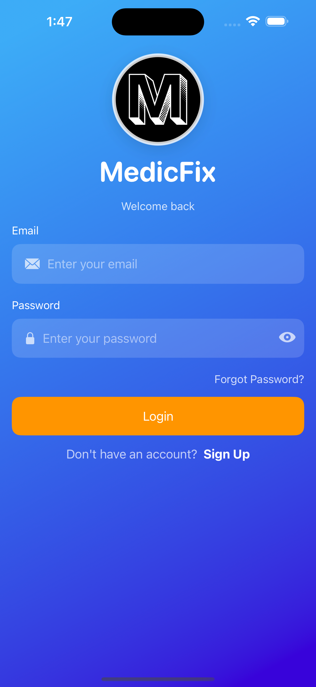
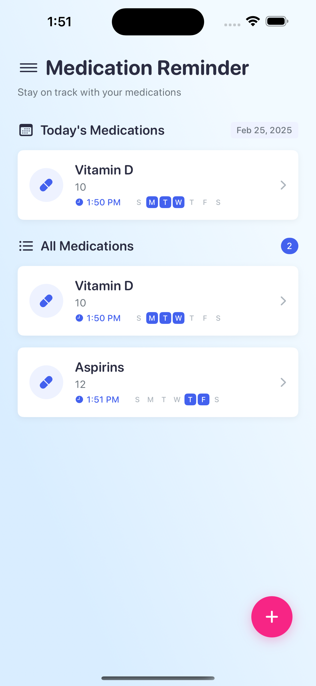
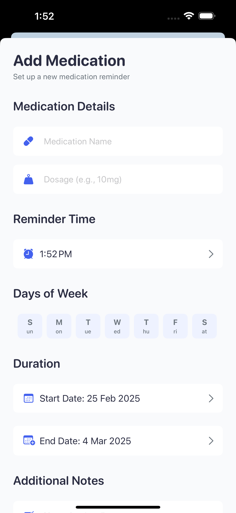
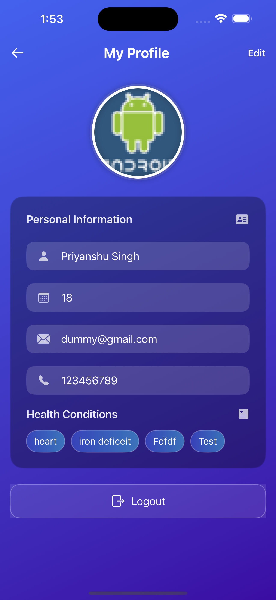
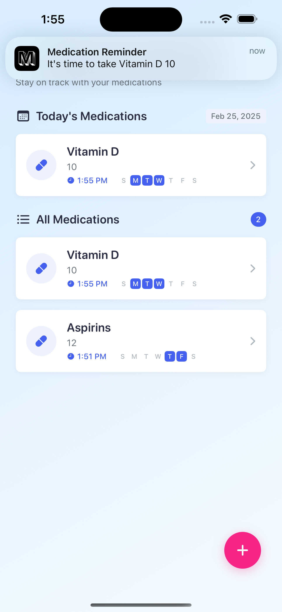
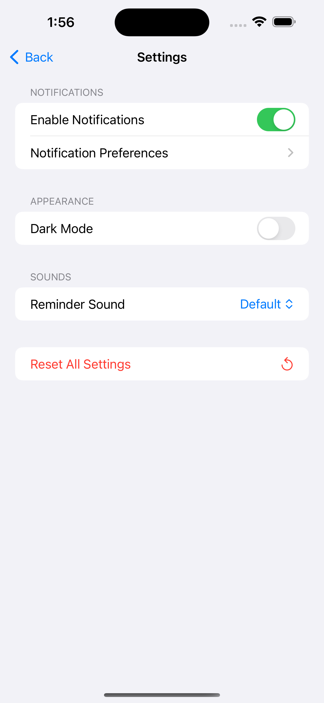

# MedicFix: Smart Medication Reminder App

<p align="center">
  <!-- You'll replace this with your actual app logo -->
  
</p>

<p align="center">
  A comprehensive medication management solution built with SwiftUI and Firebase
</p>

## ✨ Features

- **User Authentication**: Secure login and registration using Firebase Auth
- **Medication Tracking**: Create, manage, and track medication schedules
- **Smart Reminders**: Configurable reminders with custom time and frequency settings
- **Profile Management**: Personalized profiles with health condition tracking
- **Intuitive UI**: Clean, modern interface with smooth animations
- **Cross-device Syncing**: Cloud-based data syncing via Firebase

## 📱 Screenshots

<p align="center">
  <table>
    <tr>
      <!-- Replace these with actual screenshots -->
      <td></td>
      <td></td>
      <td></td>
    </tr>
    <tr>
      <td></td>
      <td></td>
      <td></td>
    </tr>
  </table>
</p>

## 🏗️ Technical Architecture

MedicFix is built using a modern tech stack that emphasizes code maintainability, performance, and user experience:

### Frontend
- **SwiftUI**: Declarative UI framework for building the entire user interface
- **Combine**: For reactive programming and state management
- **Swift Concurrency**: Leveraging async/await patterns for asynchronous operations

### Backend & Storage
- **Firebase Authentication**: Secure user authentication with email/password
- **Cloud Firestore**: NoSQL database for storing medication schedules and user profiles
- **Firebase Storage**: For storing profile images and other media assets
- **Firebase Cloud Messaging**: For delivering reliable push notifications

### Project Structure

The app follows the MVVM (Model-View-ViewModel) architecture pattern:

```
/MedicFix
  /Models         # Data models (Medication, ReminderTime)
  /Views          # UI components and screens
    /Components   # Reusable UI elements
  /ViewModels     # Business logic and state management
  /Managers       # Service layer (Auth, Storage, Notifications)
  /Utilities      # Helper functions and constants
```

## 🔧 Core Technical Components

### Authentication Flow

The app implements a secure authentication system with Firebase Auth, supporting:
- Email and password authentication
- Persistent login sessions
- Secure profile management

### Data Synchronization

MedicFix uses Firebase Firestore to synchronize medication data across devices:
- Real-time data updates
- Offline support with local caching
- Efficient data queries with Firestore indices

### Notification System

The app's reminder system is built with UserNotifications framework and Firebase Cloud Messaging:
- Scheduled local notifications for medication reminders
- Custom notification sounds and actions
- Reliable delivery across device states

### Profile Image Management

MedicFix implements an efficient profile image system using Firebase Storage:
- Image compression before upload to optimize bandwidth
- Caching of downloaded images for performance
- Progressive loading for a smooth user experience

## 🚀 Getting Started

### Prerequisites

- Xcode 14.0+
- iOS 15.0+
- Swift 5.5+
- CocoaPods

### Installation

1. Clone the repository
```bash
git clone https://github.com/Priyanshu-Singhz/MedicFix.git
cd MedicFix
```

2. Install dependencies
```bash
pod install
```

3. Open the workspace
```bash
open MedicFix.xcworkspace
```

4. Add your Firebase configuration
   - Create a Firebase project at [Firebase Console](https://console.firebase.google.com/)
   - Add an iOS app to your Firebase project
   - Download the `GoogleService-Info.plist` and add it to your Xcode project
   - Enable Authentication, Firestore, and Storage in the Firebase Console

5. Build and run the app in Xcode

## 🔮 Future Enhancements

- Medication interaction warnings
- Integration with Apple Health
- Medication adherence analytics
- Family sharing capabilities
- Doctor appointment scheduling
- Prescription refill reminders

## 📄 License

This project is licensed under the MIT License - see the LICENSE file for details.

## 🤝 Contact

Your Name - Priyanshu Singh

Linkedin: ([Linkedin](https://www.linkedin.com/in/priyanshusingha/))

Project Link: ([https://github.com/Priyanshu-Singhz/MedicFix](https://github.com/Priyanshu-Singhz/MedicFix))

---

<p align="center">
Built with ❤️ using SwiftUI and Firebase
</p>
